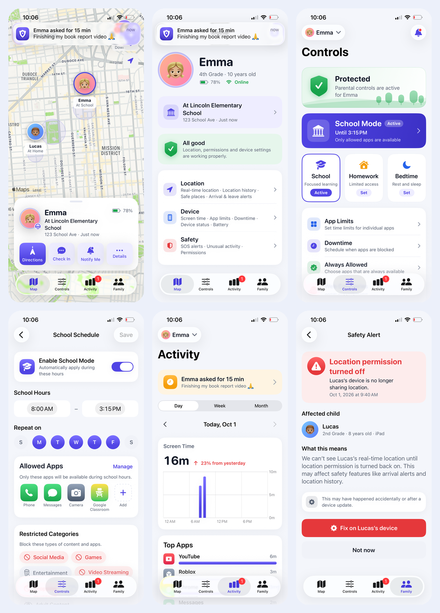
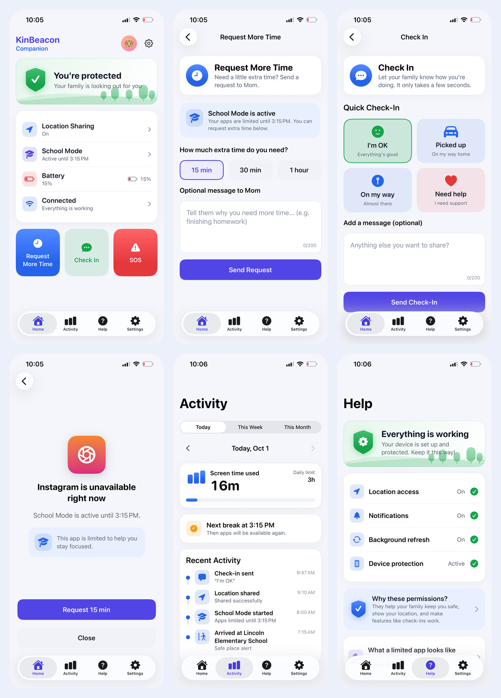
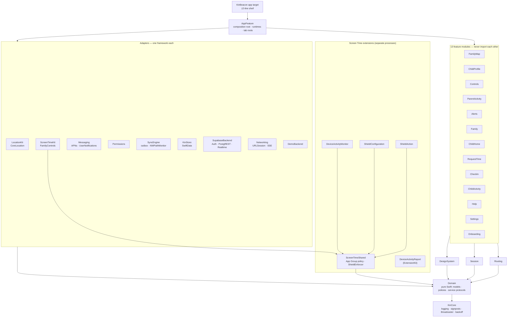

<div align="center">


# KinBeacon — family safety & parental controls for iOS

**Live family map · School Mode with Apple Screen Time · check-ins & SOS · remote commands · battery-aware background location**


-blueviolet)

</div>

<p align="center">
  
  
</p>
<p align="center"><sub>Real screenshots captured by the XCUITest walk-through on an iPhone 13 (iOS 26.7), not mock-ups. Left: parent. Right: child.</sub></p>

---

## For reviewers: the 60-second version

| Claim | Evidence |
|---|---|
| A **real, shippable product** | live backend (Supabase: Auth, RLS-protected Postgres, Realtime, Edge Function for APNs) — parent sign-up, family, 6-digit device pairing, account deletion — verified end to end **on a physical iPhone** by UI tests against the live backend; App Store package in [docs/APP_STORE.md](docs/APP_STORE.md) |
| Production-grade **architecture** | 30 SPM modules, features never import each other, a pure `Domain` layer, every platform framework confined to one adapter module → [Architecture](#architecture) |
| **System-level APIs** a parental-control app needs | FamilyControls + ManagedSettings + DeviceActivity with **4 app extensions**, CoreLocation (`CLLocationUpdate`, `CLMonitor`, `CLBackgroundActivitySession`, significant-change), APNs silent pushes, BGTaskScheduler, SwiftData, MetricKit → [System integrations](#system-integrations) |
| **Swift 6 concurrency**, not just async/await sprinkled on | `-swift-version 6`, complete strict checking, `-warnings-as-errors`, actors for every stateful service, `@MainActor @Observable` view models, zero `@unchecked Sendable` in product code → [Concurrency](#swift-concurrency-model) |
| **Fast**: measured, not claimed | cold launch **400 ms** (child) / **442 ms** (parent) to first frame on an iPhone 13, Release, 5 runs each; **0** embedded dynamic frameworks → [Performance](#performance) |
| **Tested** | **113** swift-testing tests (incl. a Supabase end-to-end suite and 19 pgTAP RLS tests server-side) + **13** XCUITests (2 against the live backend) + 2 launch-metric tests, all run on a **physical iPhone 13** → [Testing](#testing) |
| **App Store ready** | privacy manifest, purpose strings, permission priming, data retention, Screen Time privacy model, signed remote commands → [App Store & policy](#app-store-readiness--platform-policy) |

Built against the brief *"native mobile, background location, battery-efficient processing, push + remote commands,
permissions & background limits, platform policy for sensitive permissions, parental control / family safety"*.
Each of those has a section below that points to the exact files.

---

## Contents

- [Website](#website)
- [Run it](#run-it)
- [Features](#features)
- [Architecture](#architecture)
- [System integrations](#system-integrations)
  - [Background location & battery](#1-background-location-that-respects-the-battery)
  - [Screen Time: School Mode, shields, extra time](#2-screen-time-school-mode-shields-extra-time)
  - [Push notifications & remote commands](#3-push-notifications--remote-commands)
  - [Permissions & tamper detection](#4-permissions--tamper-detection)
  - [Offline-first delivery](#5-offline-first-delivery-swiftdata-outbox)
- [Swift concurrency model](#swift-concurrency-model)
- [Performance](#performance) · [Debugging performance](#how-performance-is-debugged)
- [Testing](#testing)
- [App Store readiness & platform policy](#app-store-readiness--platform-policy)
- [Decisions & trade-offs](#decisions--trade-offs)
- [Project layout](#project-layout) · [Limitations & roadmap](#limitations--roadmap)

---

## Website

Explore the app at **[devzahirul.github.io/KinBeacon-iOS](https://devzahirul.github.io/KinBeacon-iOS/)** — a responsive product website with real parent and child screenshots, an interactive gallery, features, setup, and privacy information.

Website source and publishing instructions: [website/README.md](website/README.md).

---

## Run it

```bash
brew install xcodegen          # the .xcodeproj is generated from project.yml
make project && open KinBeacon.xcodeproj
```

Pick the **KinBeacon** scheme and run it on a device or simulator.

- **Live mode** (real accounts): copy `Config/Supabase.local.example.xcconfig` to `Config/Supabase.local.xcconfig` with
  your project host + *publishable* key, and apply `supabase/migrations` ([backend guide](supabase/README.md)).
  Parent: *I'm a parent* → create account → name family → *Add a child's device* shows a code. Child (second phone):
  *This is my child's device* → enter the code.
- **Demo mode** (no account, no server): first screen → *Try the demo*. A deterministic in-process backend simulates the
  rest of the family: Emma asks for more time, answers check-in requests, and Lucas's device has a location-permission
  problem you can fix remotely. UI tests and screenshots run against it.

| Command | What it does |
|---|---|
| `make run` | build, install and launch on the connected iPhone (parent role) |
| `make test-unit` | 113 unit tests (incl. live-backend end-to-end) on the connected iPhone |
| `make test-ui` | critical-path UI tests + screenshot walk-through |
| `make perf` | Release cold-launch measurement (`XCTApplicationLaunchMetric`) |
| `make screenshots` | regenerate `docs/screenshots` from the UI walk-through |
| `make lint` | SwiftLint `--strict` + SwiftFormat check |

Launch arguments (used by the UI tests, never by hidden debug UI): `-KinRole parent|child` (demo),
`-KinResetState YES`, `-KinFastSimulation YES`, `-KinQuietDemo YES`, `-KinDisableAnimations YES`.

Signing: team and bundle IDs live in `Config/Base.xcconfig` and `project.yml`. Automatic signing registers the
Family Controls (development) and App Group capabilities on first device build.

---

## Features

**Parent**
- **Family map:** live member pins, safe-place geofences, member card with battery, last seen, and directions,
  *ask to check in*, arrival alerts.
- **Child profile:** location and today's places, device (screen time, battery, mode), safety (permission health, alerts), and *Remove from family* (deletes their history; their device shows it was removed).
- **Controls:** *Protected* status, active-mode banner, School / Homework / Bedtime modes; schedule editor (hours,
  weekdays, allowed apps, restricted categories); app limits; downtime; always-allowed apps; web content filter.
- **Activity:** Day / Week / Month screen time (Swift Charts), change vs the previous period, top apps, location
  timeline, pending extra-time requests.
- **Safety alerts:** *"Location permission turned off"* with **Fix on child's device**. A remote command is sent and the
  screen flips to *Fixed* when the child's device reports back.
- **Notifications:** approve or decline extra time straight from the lock screen (actionable notification).

**Child (companion)**
- **Home:** *You're protected*, location sharing, active mode and its end time, battery, connectivity, quick actions.
- **Request more time:** 15 / 30 / 60 min plus an optional message, then a live *waiting → approved* state.
- **Check in:** *I'm OK*, *Picked up*, *On my way*, *Need help* (time-sensitive), with an optional message.
- **SOS:** hold for 3 s (no pocket-dials); VoiceOver users get an explicit action with confirmation.
- **Shield:** *"Instagram is unavailable right now"*. The real system shield comes from the ShieldConfiguration
  extension, and an in-app preview renders the identical copy.
- **Help:** permission health with one-tap fixes, plus *Why these permissions?*

---

## Architecture

### Module graph



### Why this architecture

**MVVM with `@Observable` view models + protocol-backed services, split into SPM modules by layer and by feature.**
It's the lightest structure that still gives every property a senior reviewer looks for:

| Need | How the structure delivers it |
|---|---|
| Business rules testable without a simulator | `Domain` has no UIKit, SwiftUI, CoreLocation or networking. Schedules, the upload policy, geofence hysteresis, request rate limits, permission diffing and command authentication are pure functions covered by 50 tests. |
| Platform churn contained | Each Apple framework lives in **one** module: CoreLocation in `LocationKit`, FamilyControls in `ScreenTimeKit`, SwiftData in `KinStore`, URLSession in `Networking`, UserNotifications/APNs in `Messaging`. MapKit → Google Maps or APNs → FCM is a one-module change. |
| Features built and tested in isolation | Features depend only on `Domain`, `DesignSystem`, `Routing` and `Session`. A feature asks for `any ParentControlService`, so tests hand it a fake or the demo backend. |
| No navigation spaghetti | Features emit typed routes (`ParentRoute`, `ChildRoute`). Only `AppFeature` maps route → screen, and deep links plus notification taps reuse the same router. |
| Separate processes share one brain | The Screen Time extensions link only `ScreenTimeShared` + `Domain`, so the shield, the monitor and the app run the **same** `ModeResolver` on the **same** App Group document. |
| Fast incremental builds | 30 small modules plus `InternalImportsByDefault`: editing a screen recompiles one module (3.7 s incremental on an M1). |
| A thin app target | `App/Sources/KinBeaconApp.swift` is 12 lines. Everything else is in `Packages/KinKit`. |

**Why not TCA / VIPER / Clean-with-UseCases?** TCA is a strong choice when a team already uses it; here it would add a
large dependency and a learning curve for every future contributor. VIPER and use-case-per-action add files without
adding isolation that modules and protocols don't already provide. Observation already gives fine-grained,
property-level view invalidation, which was the main benefit a store-based approach would bring.

### Runtime structure

```mermaid
flowchart LR
    subgraph Parent device
      FS[FamilyStore<br/>@MainActor @Observable] -- one subscription --> BE1[(FamilyRepository<br/>FamilyEventFeed)]
      Map & Controls & Activity & Alerts --> FS
    end
    subgraph Child device
      CR[ChildRuntime] --> LP[LocationPipeline actor] --> SE[SyncEngine actor] --> OB[(SwiftData outbox)]
      CR --> ST[ScreenTimeController] --> AG[(App Group policy.json)]
      CR --> RCP[RemoteCommandProcessor actor]
      AG --> MON[Monitor ext.] & SHD[Shield ext.]
    end
    SE -- HTTPS + Idempotency-Key --> API[(Backend)]
    API -- SSE --> BE1
    API -- APNs silent push, HMAC-signed --> RCP
```

`AppContainer` is the composition root. Its `init` parses launch arguments and reads three `UserDefaults` keys,
nothing else. It builds a **`ParentRuntime`** or a **`ChildRuntime`** for the device's role. Each runtime owns that role's
object graph, and its long-lived work starts from the root view's `.task {}` **after the first frame**.

---

## System integrations

### 1. Background location that respects the battery

`LocationKit/LiveLocationTracker.swift`, `LocationKit/LocationPipeline.swift`, `Domain/LocationPolicy.swift`

Battery cost on iOS is dominated by **GPS radio time** and **cellular radio wake-ups**. The design attacks both:

| Profile | Chosen when | Mechanism | Upload rule |
|---|---|---|---|
| `.live` | SOS open / parent watching | `CLLocationUpdate.liveUpdates(.fitness)` | every 10 m / 5 s |
| `.balanced` | default | `liveUpdates(.otherNavigation)`; iOS pauses delivery while `stationary` | ≥ 75 m **and** beyond combined accuracy, ≤ 1/min, heartbeat 15 min |
| `.lowPower` | battery ≤ 20 % and not charging, or Low Power Mode | significant-location-change (cell/Wi-Fi, ~500 m) | ≥ 400 m, heartbeat 30 min |

- **Profile switching** is driven by `PowerMonitor` (battery level/state, `NSProcessInfoPowerStateDidChange`,
  foreground/background) → pure `LocationUploadPolicy.profile(for:)` → the tracker restarts the right mechanism.
- **Jitter rejection:** a fix is uploaded only if it moved further than the *combined* accuracy radius of both fixes,
  so a child sitting in a classroom doesn't stream noise.
- **Batching:** accepted fixes are held until the profile's interval passes, then go out in one request. Geofence
  transitions and SOS bypass batching.
- **Geofences survive termination:** safe places use `CLMonitor` (iOS 17), which keeps evaluating while the app is
  suspended or killed and relaunches it on a transition. A `CLBackgroundActivitySession` keeps live updates eligible in
  the background.
- **Fixes are stored locally first** (SwiftData) and pruned after 30 days.
- **Authorization is two-step:** *When In Use* first, then the *Always* upgrade as a separate, explained step (the only
  flow iOS and App Review accept).

### 2. Screen Time: School Mode, shields, extra time

`ScreenTimeKit/`, `ScreenTimeShared/`, `Extensions/*`

| Component | Process | Job |
|---|---|---|
| `LiveScreenTimeController` | app | `AuthorizationCenter` (`.child` on a child device: revocable only with the parent's Apple ID), persists `SharedPolicy`, (re)schedules `DeviceActivityCenter`, enforces immediately |
| `KinActivityMonitor` | DeviceActivityMonitor ext. | wakes at schedule boundaries **even if the app is terminated** and applies or clears shields |
| `KinShieldConfiguration` | ShieldConfiguration ext. | renders *"Instagram is unavailable right now"* |
| `KinShieldAction` | ShieldAction ext. | *Request 15 min* → queues a request in the App Group; the app sends it through the outbox |
| `KinReportExtension` | DeviceActivityReport ext. | usage totals rendered **inside Apple's privacy sandbox** (raw usage never reaches our process) |

Platform constraints this design handles explicitly (each is documented in code):
- **15-minute minimum interval.** `DeviceActivitySchedule` rejects shorter windows, which is why the shortest extra-time
  option is 15 min and the schedule editor validates duration.
- **20 monitored activities per app.** One activity per (mode, weekday) would need 3 × 7 = 21, so every-day
  schedules collapse into one daily activity (`ActivityPlan`, tested). The plan checks the limit before scheduling.
- **Allow-list enforcement.** `shield.applicationCategories = .all(except: allowed)` fails closed: a newly installed
  game is blocked by default. Each mode writes its own named `ManagedSettingsStore`, so clearing one mode can never lift
  another's restrictions.
- **~6 MB memory ceiling for the monitor extension.** It links only `ScreenTimeShared` (no SwiftUI, no SwiftData)
  and reads one small JSON document.
- **Cross-process consistency.** The policy file is replaced atomically (write-then-rename). Shield requests are
  one file each: the extension only creates and the app only deletes, so no locking is needed.
- **Stale configurations.** Controls carry a server `revision`, and the device ignores older revisions.
- **iOS 26.4 `AuthorizationStatus.approvedWithDataAccess`** is handled without an availability-gated case.

### 3. Push notifications & remote commands

`Messaging/RemoteCommandProcessor.swift`, `Domain/RemoteCommand.swift`, `Messaging/NotificationContentFactory.swift`

A parent can send *locate now*, *apply controls*, *grant or deny extra time*, *ask for a check-in*, *fix permission*,
and *start a live session*, all delivered as **silent pushes** (`content-available: 1`).

- **Push is only a doorbell:** in the live backend a command is a row in `kinbeacon.commands` (RLS: only a parent of the
  same family can insert, only the target device can read and acknowledge). The APNs payload carries no instruction —
  it wakes the device, which fetches its commands over its authenticated connection (Realtime while running). For
  transports where the payload itself carries the command, `CommandAuthenticator` HMAC-signs it with a per-device key,
  so a leaked APNs credential alone can't unlock a child's apps. Tampered, expired, misaddressed,
  future-dated (beyond 5 min of skew) and replayed commands are rejected, and each case is unit-tested.
- **Idempotent:** the command id is recorded in a SwiftData ledger *before* execution, so redelivery after a crash
  never runs it twice.
- **Inside the background budget:** a silent push gets ~30 s. The processor races the handler against a 25 s deadline,
  and the outcome maps to `UIBackgroundFetchResult` (iOS uses that to decide how generously to wake the app next time).
- **Not dependent on APNs alone:** silent pushes are throttled and dropped after a force-quit, so the BGAppRefresh
  heartbeat also fetches `/v1/me/commands`.
- **User-facing notifications:** categories with actions (*Approve* / *Not now* run in the background without opening
  the app). *Need help* and SOS use `interruptionLevel = .timeSensitive` to break through Focus, *I'm OK* is `.passive`,
  and safety alerts keep their title visible even when previews are hidden.
- Notification permission is requested **in context** during onboarding, never at first launch. APNs token
  registration happens at launch because it shows no prompt.

### 4. Permissions & tamper detection

`Permissions/LivePermissionsProvider.swift`, `Domain/Safety.swift`, `HelpFeature`, `AlertsFeature`

- The child device reports a `PermissionHealthReport` (location *Always + precise*, notifications, background refresh,
  Screen Time) on launch, on foreground and from the background heartbeat.
- `PermissionHealthEvaluator` diffs consecutive reports. A **regression** becomes a parent alert, for example
  *"Location permission turned off"*. Background refresh is reported but not alerted, because Low Power Mode toggles it.
- *Fix on child's device* sends `fixPermissions` → the child gets a notification that deep-links to the right
  Settings pane. No app can re-enable a permission itself, and this design doesn't pretend otherwise.
- When-In-Use or approximate location counts as **limited**, not granted, because arrival alerts need *Always* +
  precise.

### 5. Offline-first delivery (SwiftData outbox)

`SyncEngine/SyncEngine.swift`, `KinStore/KinDatabase.swift`

Every child action (check-in, request, SOS, location batch, health report) is **written to SwiftData first** and then
sent:
- **Durable.** An *I'm OK* typed in a lift is delivered when the signal returns, even if iOS kills the app in between.
- **Priority lanes.** SOS (0) → check-ins and requests (1) → permissions (2) → locations (3) → battery (4). An SOS never
  waits behind 200 queued fixes.
- **Coalesced.** All queued location batches go out as one request, so the radio wakes once.
- **Single-flight.** Triggers from foreground, connectivity regained (`NWPathMonitor`), the BG task and new actions
  join the in-flight flush instead of racing it.
- **Retries.** Capped exponential backoff with full jitter, so a classroom of devices regaining Wi-Fi doesn't hammer the
  API in lock-step. Transient errors (offline, 5xx, 429) are retried; permanent 4xx are dropped so they can't block
  the queue.
- **Exactly-once effect.** Every POST carries the entity UUID as an `Idempotency-Key`.
- **Live data for parents** uses Server-Sent Events over `URLSession.bytes`. The parser handles a subtle bug:
  `AsyncLineSequence` (`bytes.lines`) **drops empty lines**, and an empty line is exactly the SSE event delimiter, so
  the client splits the byte stream itself.

---

## Swift concurrency model

The whole package compiles with **Swift 6 language mode, complete strict concurrency, `ExistentialAny`,
`InternalImportsByDefault` and `-warnings-as-errors`**.

| Kind of state | Isolation | Example |
|---|---|---|
| UI state, view models, stores | `@MainActor @Observable final class` | `FamilyStore`, `ControlsModel`, `RequestTimeModel` |
| Mutable services | `actor` | `SyncEngine`, `LocationPipeline`, `RemoteCommandProcessor`, `DemoBackend`, `GeofenceMonitor` |
| Database | `@ModelActor actor` (own background `ModelContext`) | `KinDatabase` — only `Sendable` domain values cross its boundary |
| Values crossing boundaries | `struct … : Sendable` | every `Domain` type |
| Multicast streams | lock-protected `Sendable` class (`OSAllocatedUnfairLock`) | `Broadcaster<Element>`: a hot, replaying `AsyncStream` source (the Swift counterpart of `StateFlow`) |
| CoreLocation delegate | `@MainActor` bridge, `@preconcurrency` conformance | `ManagerBridge` |

Rules followed throughout:
- **Structured concurrency first.** Screens use `.task {}` and `.task(id:)`, which cancel automatically and drop stale
  loads when the child or date changes. Runtimes fan out with `async let` and task groups. Every `AsyncStream` has an
  `onTermination` that cancels its producer, so leaving a screen tears the work down.
- **No GCD in product code.** The one `DispatchQueue` is the queue `NWPathMonitor`'s API requires.
- **No `@unchecked Sendable` in product code.** It appears only in one test double.
- **Cancellation is honoured:** `Task.checkCancellation()` before publishing results; loops check `Task.isCancelled`.
- **Background work that must not block launch** (`DeferredDatabase`) runs as a detached utility task whose value is
  awaited lazily.
- **Time is injected** (`now: () -> Date`, `TestClock`) so concurrency tests never `sleep` for correctness.

Two Swift 6.3 compiler issues hit along the way are worked around and commented in code: a region-isolation checker
crash on `for await … where` inside a `@MainActor` task-group closure (`FamilyStore` uses `async let` instead), and
`CLLocationUpdate.isStationary` being deprecated in the iOS 26 SDK even for an iOS 17 deployment target (iOS 18+
`stationary`, speed heuristic on 17).

---

## Performance

All numbers are from a **physical iPhone 13 running iOS 26.7** in Release, unless noted. Reproduce them with
`make perf`; the full method is in **[docs/PERFORMANCE.md](docs/PERFORMANCE.md)**.

| Metric | Result |
|---|---|
| Cold launch → first frame, child | **400 ms** avg (353–444 ms) |
| Cold launch → first frame, parent | **442 ms** avg (404–506 ms) |
| Embedded dynamic frameworks | **0** (all 30 modules + supabase-swift statically linked) |
| `.app` size, uncompressed | 14 MB (extensions 1.8 MB each, report 160 KB) |
| Unit test suite on device | 112 offline tests in < 1 s (+ the live end-to-end suite, ~10 s) |
| Incremental Debug build (M1) | 3.7 s after editing a feature file |

### How launch time was reduced

1. **Do nothing in `init`.** The composition root reads three `UserDefaults` keys. No networking, no database, no
   CoreLocation, no MetricKit before the first frame (`launch.*` signposts prove it).
2. **Defer and parallelise I/O.** SwiftData's `ModelContainer` is opened on a detached utility task
   *while* the first frame renders (`DeferredDatabase`). Runtimes start their streams from `.task {}`.
3. **Zero dylibs.** Static SPM linking (including supabase-swift) leaves dyld nothing extra to load or bind; the
   Supabase client is created lazily on first use, never during a demo launch.
4. **Cheap first frame.** Vector avatars and app tiles (no image decoding), system fonts, and a launch screen that
   matches the first frame's background, so there is no flash.
5. **Stale-while-revalidate.** In production mode the last family snapshot is cached as one JSON file (cheaper than a
   database) and drawn immediately; the live stream replaces it.

### How it stays smooth

- **Observation granularity:** a location tick invalidates only views that read `snapshot`. Settings, controls and
  charts don't re-render.
- **One upstream subscription per role**, fanned out by `Broadcaster`, instead of one network stream per screen.
- **Off-main work:** decoding, persistence, the outbox and location filtering all run on actors; the main actor only
  assigns ready values.
- **`Equatable` map pins** and stable `ForEach` identities keep annotation views from being rebuilt on every tick.
- **Bounded chart data** (24 hourly or ≤ 31 daily buckets), precomputed before it reaches Swift Charts.
- **Haptics and animations on meaningful state changes only**, and Reduce Motion is honoured (SOS ring scale).

## How performance is debugged

| Tool | Used for |
|---|---|
| **`os_signpost` via `Perf`** (compiled into Release) | launch phases, `storage.open`, `sync.flush`, `network.request` in Instruments' Points of Interest |
| **Instruments: App Launch** | dyld + `launch.*` intervals → first frame |
| **Instruments: Time Profiler / SwiftUI / Animation Hitches** | main-thread cost, body re-evaluation storms, hitches while the map card animates |
| **Allocations, Leaks, Xcode Memory Graph** | retain cycles in long-lived runtimes; the 6 MB DeviceActivityMonitor budget |
| **Power Profiler + Xcode Organizer Energy** | GPS time and radio wake-ups of the backgrounded child app |
| **MetricKit** (`MetricsReporter`) | field launch-time and hang histograms, crash and hang diagnostics |
| **`XCTApplicationLaunchMetric`** | repeatable Release launch numbers (`make perf`) |
| **`os.Logger`** per subsystem, coordinates `.private` | `log stream --predicate 'subsystem == "com.lynkto.kinbeacon"'` |
| **lldb `_simulateLaunchForTaskWithIdentifier`**, `simctl push`, Network Link Conditioner, GPX | background refresh, silent pushes, bad networks, movement |

---

## Testing

| Layer | Framework | Count | What it covers |
|---|---|---|---|
| Domain & core | swift-testing | 54 | schedules (incl. overnight and week-start locales), mode priority and grants, upload policy and thinning, geofence hysteresis, request policy, permission diffs, HMAC command auth, aggregation, backoff, `Broadcaster` |
| Data | swift-testing | 24 | SwiftData outbox ordering, retries and ledger, retention; `SyncEngine` priority, coalescing, backoff, single-flight, durability; `APIClient` requests, errors and retries; SSE parsing; demo backend |
| Platform | swift-testing | 16 | remote-command processor (exactly-once, expiry, 25 s budget), APNs payload parsing, notification content and interruption levels, shield copy, `ActivityPlan` limits, App Group store, `LocationPipeline` |
| Feature view models | swift-testing | 18 | request-time waiting → approved, check-in, controls draft/save/rollback, family store, safety-alert fix, onboarding state machine, help, deep links and router |
| Backend end-to-end | swift-testing + live Supabase | 1 suite | sign-up → family → invite → wrong code rejected → pair → location → place → idempotent request → approval → "Need help" alert → Realtime event → command → ack → permission alert → resolve → account deletion |
| Database | pgTAP (19) | — | RLS isolation between families, single-use codes, no self-approval, server-owned revisions, account deletion |
| UI (critical paths) | XCUITest | 13 | approve a request, fix an alert remotely, edit and save a schedule, remove a child, request time, check in, hold-to-SOS, both onboarding paths, screenshot walk-through, **live parent sign-up → invite → delete account**, **live child pairing** (test plays the parent over REST) |
| Performance | XCTest metrics | 2 | Release cold launch, parent and child |

- **Everything runs on a physical iPhone** (`make test`). The package tests are hosted in an empty `KinKitTestHost`
  app: hosting them in KinBeacon would link the package twice and force Xcode to turn modules into dynamic frameworks.
- **CI** (GitHub Actions) runs strict lint, the same tests on a simulator, and a Release build with warnings as errors.
- **View-model tests use the real demo backend** (fast beat), which is the same integration the app runs, plus
  scripted fakes for failure paths. Async tests use polling helpers with deadlines, never fixed `sleep`s.

---

## App Store readiness & platform policy

- **`PrivacyInfo.xcprivacy`:** precise location and user content are declared as *app functionality*, tracking is off,
  and the required-reason API for `UserDefaults` is declared.
- **Purpose strings** say why location *Always* matters ("arrival alerts … find you in an emergency"). Permissions are
  requested one at a time after an explanation screen (priming), never at first launch.
- **Background modes** are limited to `location`, `fetch` and `remote-notification`, each with a feature that uses it.
- **Family Controls:** development entitlement is used here. Distribution needs Apple's *Family Controls (Distribution)*
  request, which is approved for parental-control apps and should be filed before the TestFlight build.
- **Screen Time privacy:** usage data stays inside Apple's report extension, and app identities are opaque tokens from
  `FamilyActivityPicker`.
- **Data minimisation:** location history is pruned after 30 days, logs redact coordinates and names, and there are no
  ads or analytics SDKs. Details: [docs/PRIVACY.md](docs/PRIVACY.md).
- **Kids & safety:** a deliberate 3-second SOS hold, time-sensitive (not critical) alerts, an explicit "call 911" hint,
  and no third-party links in the child experience.
- **Accessibility:** all text uses Dynamic Type text styles (only decorative glyphs are fixed-size), VoiceOver labels, values and actions on custom
  controls (SOS has an accessible action), 44 pt targets, light and dark themes from semantic tokens.
- **Release hygiene:** `dwarf-with-dsym`, whole-module optimisation, `VALIDATE_PRODUCT`, scripted app icon
  (opaque 1024², as App Store Connect requires), and an XcodeGen project, so `.xcodeproj` merge conflicts don't happen.

---

## Decisions & trade-offs

| Decision | Why | Cost / revisit when |
|---|---|---|
| **MapKit** instead of the Google Maps SDK | No API key, no 30+ MB binary, no extra dylib on the launch path, native SwiftUI `Map` with `Annotation` and `MapCircle` | Google Maps is a drop-in change inside `FamilyMapFeature` if the product needs cross-platform map styling |
| **APNs directly** instead of FCM | One less SDK, and silent-push semantics are explicit | Server-side sender swap; `Messaging` is the only module that would change |
| **SSE** instead of WebSocket for live parent data | Plain HTTP (works through school and corporate proxies), resumable, and the traffic is one-way | Bidirectional chat would justify `URLSessionWebSocketTask` |
| **SwiftData** for the outbox and history | First-party, `@ModelActor` gives off-main contexts | Very large histories → GRDB/SQLite with explicit indices (`#Index` needs iOS 18) |
| **No HealthKit** | Not part of these flows, and App Review rejects HealthKit data used for non-health purposes | Add it only for a genuine wellbeing feature |
| **One app, two roles** | Shared code, a single review, a simpler pairing story | Separate "Companion" target if store positioning demands it |
| **Demo backend in the shipping binary** | Reviewers can run every flow offline; UI tests and screenshots are deterministic | Compile it out of production builds with a flag |
| **Supabase** (Postgres + RLS + Realtime) as the backend, `supabase-swift` as the **only** third-party dependency, confined to `SupabaseBackend` | Row-level security makes "a family only sees itself" a database guarantee (19 pgTAP tests), Realtime replaces a hand-built socket server; the rest of the app only sees Domain protocols | Swap for a custom API by implementing the same protocols (`RESTBackend` + `docs/API.md` already exist) |

---

## Project layout

```
App/                      12-line SwiftUI shell, Info.plist (generated), assets, privacy manifest
Extensions/               DeviceActivityMonitor · ShieldConfiguration · ShieldAction · DeviceActivityReport
Packages/KinKit/
  Sources/
    KinCore/              logging, signposts, Broadcaster, backoff, launch options, formatting
    Domain/               models, policies (schedules, location, requests, permissions), service protocols, command auth
    ScreenTimeShared/     App Group policy store, shield copy, ActivityPlan, ShieldEnforcer (app + extensions)
    KinStore/             SwiftData @ModelActor database, snapshot cache
    Networking/           APIClient (URLSession async/await), SSE parser, RESTBackend
    DemoBackend/          deterministic in-process family simulation
    SyncEngine/           outbox delivery, connectivity monitor
    LocationKit/          CLLocationUpdate / CLMonitor tracker, power monitor, upload pipeline
    ScreenTimeKit/        FamilyControls controller, system app picker, simulator stand-in
    Messaging/            APNs, notification categories and content, remote-command processor
    Permissions/          live + simulated permission providers
    DesignSystem/         tokens (light/dark), components, hero illustration, charts
    Routing/  Session/    typed routes and routers; shared @Observable stores
    *Feature/             13 feature modules
    AppFeature/           composition root, runtimes, root views, app delegate, scene, background tasks
    TestSupport/          fakes, fixtures, test clock
  Tests/                  DomainTests · DataTests · PlatformTests · FeatureTests (swift-testing)
UITests/                  XCUITest flows, screenshot walk-through, launch metrics
docs/                     API contract, privacy, performance playbook, screenshots
scripts/                  icon generator, screenshot export, build/test helpers
```

---

## Found on a real device

Two bugs only showed up on hardware — and how they were handled is part of the point:

| Symptom | Root cause (from the device crash log) | Fix + guard |
|---|---|---|
| Child app aborted right after pairing | `CLMonitor("kinbeacon.places")` → `NSInternalInconsistencyException: Monitor name is not valid` (dots aren't allowed); the simulator path never creates a CLMonitor | alphanumeric name, one process-wide single-flight `GeofenceMonitor`, and a test that creates the monitor with the real name **on the device** |
| Screen Time report empty on the child iPhone | `codesign -d --entitlements` showed **no** Family Controls / App Group / Push entitlements: XcodeGen rewrote the `.entitlements` files as empty dictionaries (path given, no properties); `.child` authorization also always fails on an adult Apple ID | entitlements declared in `project.yml` (generated, signed — verified with `codesign`); `.child` → `.individual` fallback; report extension now renders total, pickups, an hourly chart and top apps with their real icons via `Label(token)` |
| Location step's *Continue* spun forever | iOS shows each location prompt once and doesn't call the delegate when it skips one | resolve when no prompt appears (app stays active) or on `didBecomeActive`; "Turn on" opens Settings when iOS won't prompt again |
| "This device is already paired" on re-onboarding | a previous Supabase session in the Keychain was reused for the child | every pairing signs out and uses a fresh device account; covered by the live pairing UI test |

## Limitations & roadmap

- **Family Controls Distribution entitlement:** development builds work today; TestFlight/App Store builds need Apple to
  approve the distribution entitlement for the app and its 4 extensions ([checklist](docs/APP_STORE.md)).
- **Background push** needs an APNs key in the Edge Function secrets ([guide](supabase/README.md)); until then
  updates arrive in real time while the app runs and via Background App Refresh.
- **Screen-time numbers** on the parent's phone come from Apple's report and require the child in the parent's
  Family Sharing group.
- **Allowed apps** are chosen on the child's iPhone (Apple's app tokens are device-specific).
- **Shared Supabase project:** for this portfolio the schema lives beside other apps in one project, so account
  deletion removes KinBeacon data but keeps the shared login; a dedicated project would delete `auth.users` too.
- **Android** isn't in this repository; the API contract is platform-neutral.

Next: parent cold launch under 400 ms (defer `Map` by one frame), a performance baseline in CI, snapshot tests for
every screen (light, dark, XXL Dynamic Type), Live Activity for an active SOS, and an App Intent for *Check in*.

---

<sub>MIT licensed. Built with Xcode 26.6 / Swift 6.3, iOS 17.0 deployment target.</sub>
